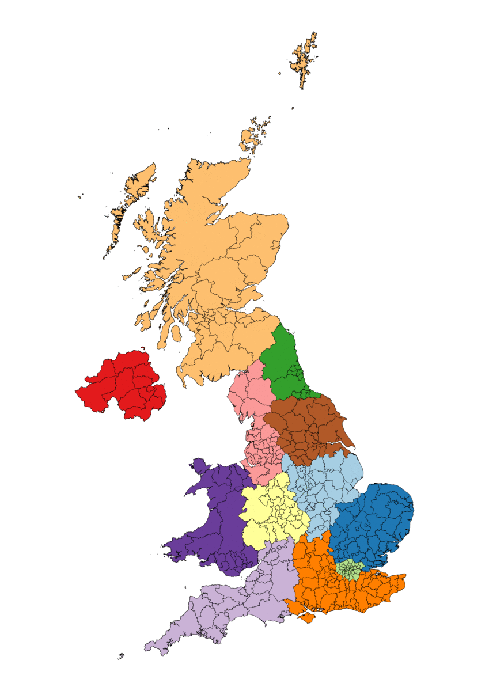
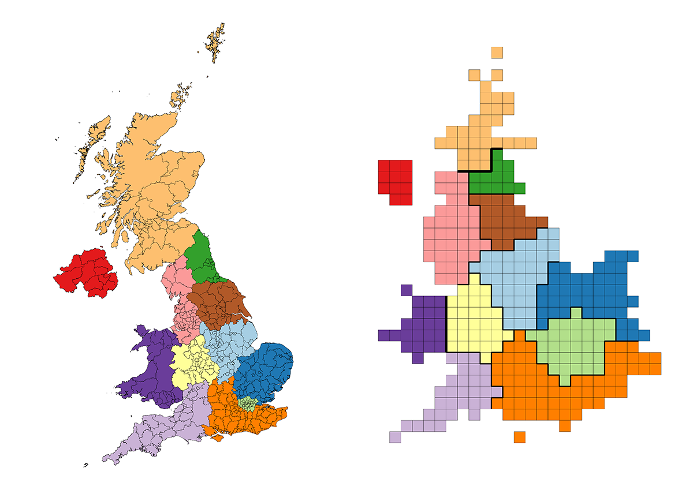
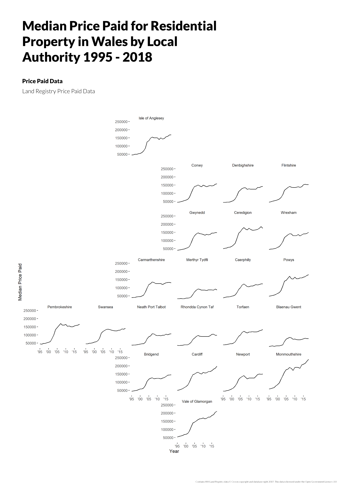
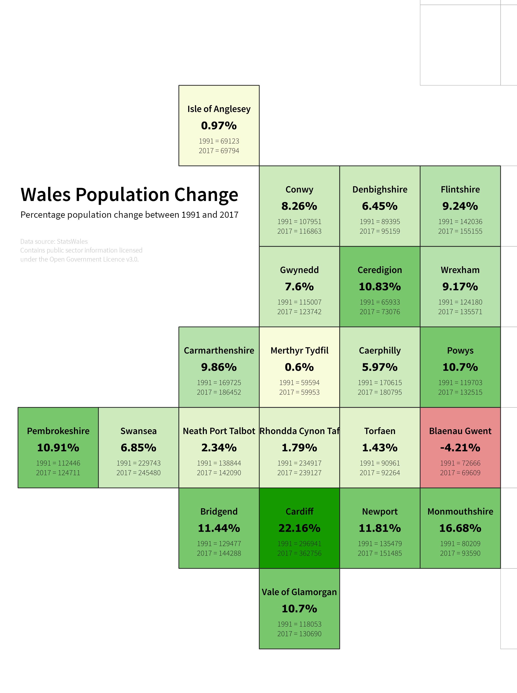

# Equal Area Cartograms

Ordnance Survey's hand-designed equal area cartograms for geographies of Great Britain (GB) and the United Kingdom (UK). Currently provides one cartogram for local authority district (LAD) geography. Additional cartograms may be released in the future.

## United Kingdom Local Authority District

A transformation of the 2019 LAD geography of the UK into a square equal area cartogram map for flexible data visualisation at local authority-level.

The cartogram preserves the grouping of LADs into the UK regions (formerly Government Office Regions (GORs)).

 

  

  

## Examples

[../local-authority-district/data-visualisation](../local-authority-district/data-visualisation)

  

  

  

  

### Features

#### Subdivisions

Each LAD square has been subdivided into 100 nested squares. The subdivisions support the visualisation of data dimensionality against each LAD. The subdivisions reference the parent LAD and are uniquely identifiable through an integer sequence based upon y, x ascending.

#### Centroids

The centroid of each LAD square is provided to support proportional symbol generation or other visualisation techniques that require a point geometry.

#### Government Statistical Service (GSS) Codes and Names

Each LAD square references the GSS code and name for the LAD, region and country.

#### Local Authority District - Region - Country Lookup

Each LAD square references the region and country it is part of.

#### Local Authority District 2018 - 2019 Lookup

A GSS code and name lookup is provided for LADs which existed in 2018 but have been amalgamated into new LADs in 2019. This lookup allows users to map pre-2019 insights at local authority-level to the 2019 baseline.

#### Welsh Naming

LAD squares in Wales reference the Welsh name in addition to the English name, and all LAD squares reference the Welsh names for the region and country.

#### Geographic Sequential Identifiers

Each LAD square is uniquely identifiable through a series of sequential identifiers based upon y, x ascending. There are three different identifiers:

1. A LAD identifier for all of the UK.
2. A LAD identifier partitioned by country.
3. A LAD identifier partitioned by region.

These identifiers may be useful when labelling each LAD square and including accompanying lookup tables next to charts where space is of a premium and using the 9-character GSS codes isn't a viable option.

#### Region Outlines

Region outlines are provided as linestring geometries and refer to the GSS code, name and Welsh name for each region.

#### Region Divisions

Region divisions are provided as linestring geometries and refer to the two regions separated by each division.

#### Country Outlines

Country outlines are provided as linestring geometry and refer to the GSS code, name and Welsh name for each country.

#### Country Divisions

Country divisions are provided as linestring geometries and refer to the two countries separated by each division.

### Coordinate Reference System

The cartogram geometry is referenced against a arbitrary cartesian grid and does not reference a 'real-world' coordinate reference system.  

### Data Formats

#### CSV

Each layer of the cartogram is provided as a seperate CSV file. The geometry is encoded using a well known text (WKT) representation.

[../local-authority-district/data/csv](../local-authority-district/data/csv)

#### GeoPackage

The layers of the cartogram are provided as individual tables / layers within a single SQLite database container.

[../local-authority-district/data/geopackage](../local-authority-district/data/geopackage)

#### geofacet

The [geofacet](https://hafen.github.io/geofacet/) R package provides a ggplot2 faceting function based upon square equal area cartogram grids.

The R code and geofacet-specific CSV format for the cartogram is provided so that users can use the grid within the geofacet library and edit the grid via the ['Grid Designer App'](https://hafen.github.io/grid-designer/) if they want a different geofacet-grid representation. The R code and CSV files provide United Kingdom, Great Britain, country and regional grid coverage.

[../local-authority-district/data/r-geofacet](../local-authority-district/data/r-geofacet)

#### SVG

The geometries of the cartogram are provided in a single SVG file.

[../local-authority-district/data/svg](../local-authority-district/data/svg)

## Authors

* Steve Kingston
* Paul Naylor
* Charley Glynn

## License

Contains National Statistics data © Crown copyright and database right 2019.

Contains OS data © Crown copyright and database right 2019.

This repo is licensed under the terms of the [Open Government Licence (OGL) v3.0](http://www.nationalarchives.gov.uk/doc/open-government-licence/version/3/). Please see [../LICENSE.txt](../LICENSE.txt).

